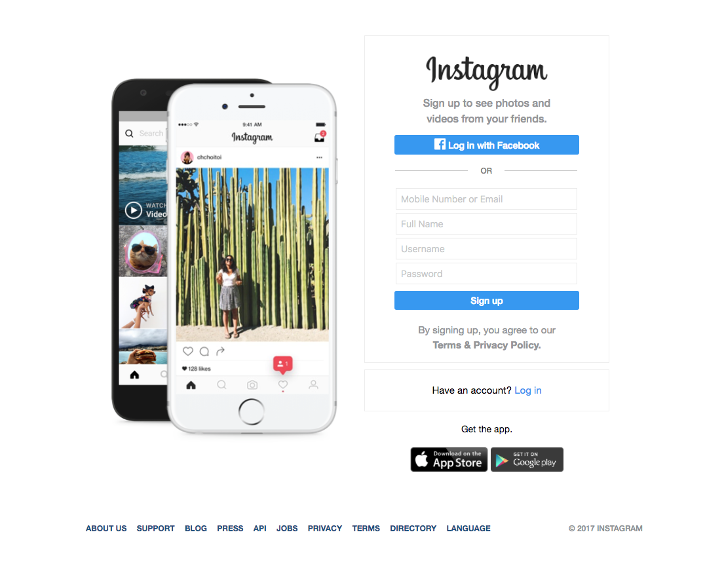
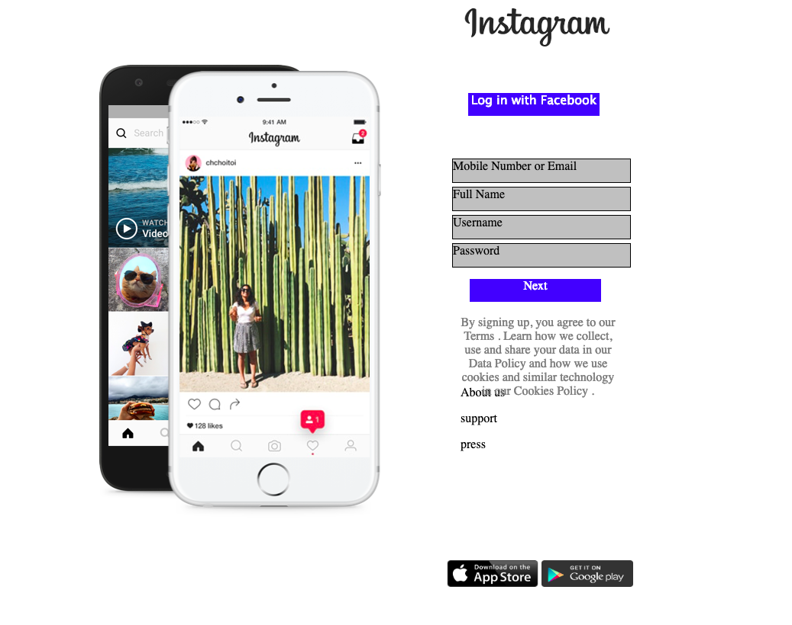

# Fake Instagram

## **Task**
Recreate the Instagram home page

## **Result**
Used css styling to create the different boxes and positioned the elements manually, using `
`.

## **Instructions**

Clone this git repository and open the .html file locally in your browser.
